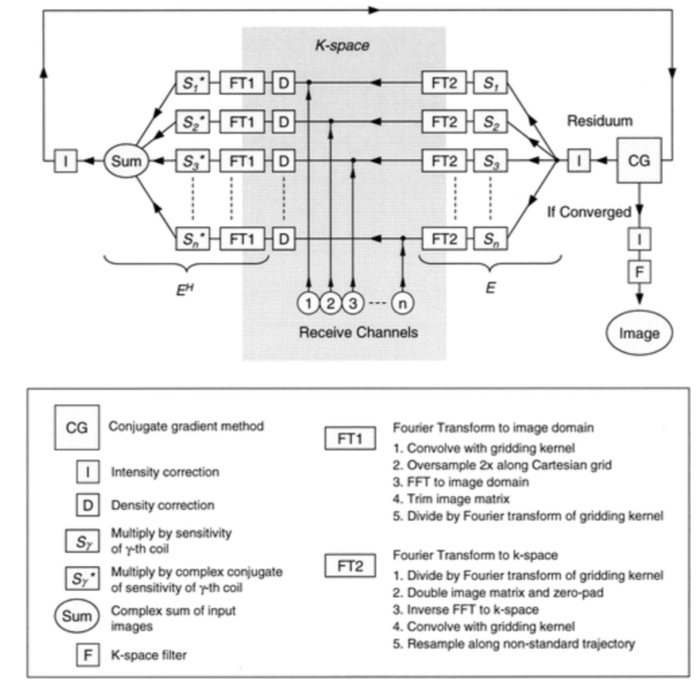

sigpy implementation for rrsg challenge (ISMRM 2019)
Original paper: Klaas P. Pruessmann, Markus Weiger, Peter Börnert, Peter Boesiger. Advances in sensitivity encoding with arbitrary k-space trajectories. Magn Reson Med. 2001 Oct;46(4):638-51.

## Implement the flowchart
 
